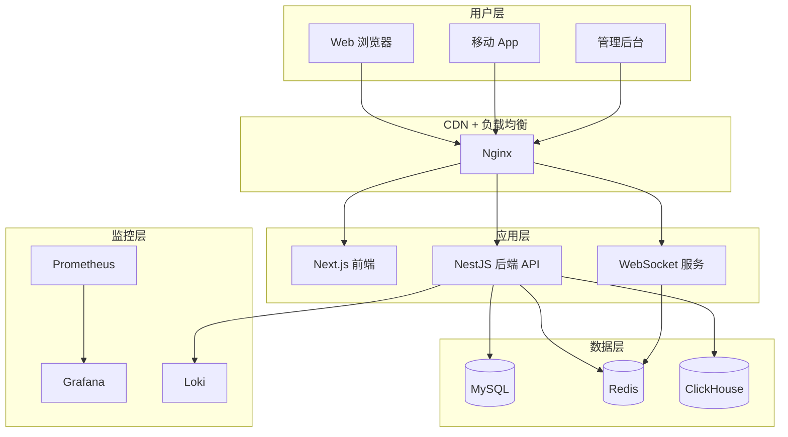

# 天策三角洲社区 - 架构设计

## 整体架构图



## 技术选型理由

### 前端：Next.js 14

**选择理由：**
- SSR 支持，利于 SEO（帖子广场、攻略中心）
- React 生态丰富，组件库多
- TypeScript 支持好，类型安全
- 性能优化好（代码分割、懒加载）

**适用场景：**
- 需要 SEO 的页面（首页、帖子列表）
- 需要快速加载的页面

### 后端：NestJS

**选择理由：**
- 架构清晰，模块化设计
- 依赖注入，易于测试
- TypeScript 原生支持
- 微服务友好
- 装饰器语法，代码简洁

**适用场景：**
- 企业级后端应用
- 需要清晰架构的项目

### 数据库：MySQL 8.0

**选择理由：**
- 成熟稳定，社区活跃
- 支持事务，ACID 保证
- 性能好，适合中小规模数据
- 运维成熟，工具丰富

**适用场景：**
- 用户数据、帖子数据、订单数据

### ORM：Prisma

**选择理由：**
- 类型安全，自动生成类型
- 迁移方便，版本管理清晰
- 查询性能好
- 支持多数据库

### 缓存：Redis 7.0

**选择理由：**
- 高性能，内存存储
- 支持多种数据结构
- 持久化支持
- 集群支持

**适用场景：**
- 用户会话
- 热点数据缓存
- 排行榜
- 限流计数

### 埋点存储：ClickHouse

**选择理由：**
- 列式存储，查询快
- 适合大数据量
- 压缩率高

**适用场景：**
- 用户行为埋点
- 日志分析

## 微服务划分

### 单体架构（MVP 阶段）

暂不拆分微服务，使用模块化单体架构：

```
NestJS 应用
├── auth 模块（认证）
├── users 模块（用户）
├── posts 模块（帖子）
├── teams 模块（组队）
├── orders 模块（订单）
├── analytics 模块（埋点）
└── common 模块（公共）
```

### 未来微服务拆分（可选）

当用户量 > 10 万时考虑拆分：

1. **用户服务**：认证、用户管理
2. **社区服务**：帖子、评论、点赞
3. **组队服务**：组队大厅、队伍管理
4. **订单服务**：打手商城、订单管理
5. **埋点服务**：数据收集、分析

## 部署拓扑

### 测试环境（Docker Compose）

```
单台服务器
├── MySQL 容器
├── Redis 容器
├── ClickHouse 容器
├── 后端 API 容器
├── 前端容器
├── Nginx 容器
├── Prometheus 容器
├── Grafana 容器
└── Loki 容器
```

### 生产环境（推荐）

```
负载均衡器（Nginx）
├── 前端服务器 x2
├── 后端服务器 x3
├── MySQL 主从（1主2从）
├── Redis 集群（3主3从）
├── ClickHouse 集群
└── 监控服务器
```

## 数据流向

### 用户请求流程

```
用户 → Nginx → 前端 → 后端 API → 数据库
                              ↓
                           Redis 缓存
                              ↓
                        ClickHouse 埋点
```

### 缓存策略

1. **查询流程**：
   - 先查 Redis
   - 命中返回
   - 未命中查 MySQL
   - 写入 Redis

2. **更新流程**：
   - 更新 MySQL
   - 删除 Redis 缓存
   - 下次查询重新缓存

## 安全架构

### 认证流程

```
用户登录 → 验证密码 → 生成 JWT → 返回 Token
                                    ↓
                              存储到 Redis
                                    ↓
后续请求携带 Token → 验证 Token → 解析用户信息
```

### 权限控制

```
请求 → JWT Guard → Roles Guard → Controller
```

## 性能优化

### 数据库优化

- 合理设置索引
- 读写分离（未来）
- 连接池配置

### 缓存优化

- 热点数据缓存
- 缓存预热
- 缓存穿透防护

### 前端优化

- 代码分割
- 图片懒加载
- CDN 加速

## 扩展性设计

### 水平扩展

- 无状态设计
- Session 存储在 Redis
- 文件存储使用 OSS

### 垂直扩展

- 数据库升级配置
- Redis 增加内存
- 服务器升级 CPU/内存
