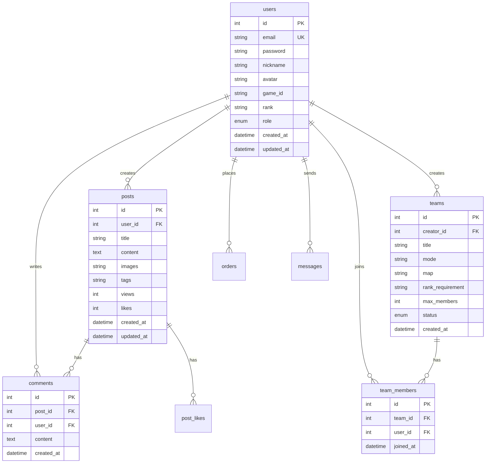

# 天策三角洲社区 - 数据库设计

## ER 图



## 数据表设计

### 1. 用户表 (users)

| 字段 | 类型 | 长度 | 必填 | 默认值 | 注释 |
|-----|------|------|------|--------|------|
| id | INT | - | 是 | AUTO_INCREMENT | 主键 |
| email | VARCHAR | 255 | 是 | - | 邮箱（唯一） |
| password | VARCHAR | 255 | 是 | - | 密码（bcrypt 加密） |
| nickname | VARCHAR | 50 | 是 | - | 昵称 |
| avatar | VARCHAR | 255 | 否 | NULL | 头像 URL |
| game_id | VARCHAR | 100 | 否 | NULL | 游戏 ID |
| rank | VARCHAR | 50 | 否 | NULL | 游戏段位 |
| role | ENUM | - | 是 | 'USER' | 角色（USER/MODERATOR/ADMIN） |
| bio | TEXT | - | 否 | NULL | 个人简介 |
| created_at | DATETIME | - | 是 | CURRENT_TIMESTAMP | 创建时间 |
| updated_at | DATETIME | - | 是 | CURRENT_TIMESTAMP ON UPDATE | 更新时间 |

**索引：**
- PRIMARY KEY (id)
- UNIQUE KEY (email)
- INDEX (created_at)
- INDEX (rank)

---

### 2. 帖子表 (posts)

| 字段 | 类型 | 长度 | 必填 | 默认值 | 注释 |
|-----|------|------|------|--------|------|
| id | INT | - | 是 | AUTO_INCREMENT | 主键 |
| user_id | INT | - | 是 | - | 用户 ID（外键） |
| title | VARCHAR | 200 | 是 | - | 标题 |
| content | TEXT | - | 是 | - | 内容 |
| images | JSON | - | 否 | NULL | 图片 URL 数组 |
| tags | VARCHAR | 255 | 否 | NULL | 标签（逗号分隔） |
| views | INT | - | 是 | 0 | 浏览量 |
| likes | INT | - | 是 | 0 | 点赞数 |
| comments_count | INT | - | 是 | 0 | 评论数 |
| status | ENUM | - | 是 | 'PUBLISHED' | 状态（PUBLISHED/DELETED） |
| created_at | DATETIME | - | 是 | CURRENT_TIMESTAMP | 创建时间 |
| updated_at | DATETIME | - | 是 | CURRENT_TIMESTAMP ON UPDATE | 更新时间 |

**索引：**
- PRIMARY KEY (id)
- INDEX (user_id)
- INDEX (created_at)
- INDEX (likes)
- FULLTEXT (title, content)

**外键：**
- FOREIGN KEY (user_id) REFERENCES users(id)

---

### 3. 评论表 (comments)

| 字段 | 类型 | 长度 | 必填 | 默认值 | 注释 |
|-----|------|------|------|--------|------|
| id | INT | - | 是 | AUTO_INCREMENT | 主键 |
| post_id | INT | - | 是 | - | 帖子 ID（外键） |
| user_id | INT | - | 是 | - | 用户 ID（外键） |
| content | TEXT | - | 是 | - | 评论内容 |
| parent_id | INT | - | 否 | NULL | 父评论 ID（回复） |
| created_at | DATETIME | - | 是 | CURRENT_TIMESTAMP | 创建时间 |

**索引：**
- PRIMARY KEY (id)
- INDEX (post_id)
- INDEX (user_id)
- INDEX (created_at)

**外键：**
- FOREIGN KEY (post_id) REFERENCES posts(id)
- FOREIGN KEY (user_id) REFERENCES users(id)

---

### 4. 帖子点赞表 (post_likes)

| 字段 | 类型 | 长度 | 必填 | 默认值 | 注释 |
|-----|------|------|------|--------|------|
| id | INT | - | 是 | AUTO_INCREMENT | 主键 |
| post_id | INT | - | 是 | - | 帖子 ID（外键） |
| user_id | INT | - | 是 | - | 用户 ID（外键） |
| created_at | DATETIME | - | 是 | CURRENT_TIMESTAMP | 创建时间 |

**索引：**
- PRIMARY KEY (id)
- UNIQUE KEY (post_id, user_id)
- INDEX (user_id)

**外键：**
- FOREIGN KEY (post_id) REFERENCES posts(id)
- FOREIGN KEY (user_id) REFERENCES users(id)

---

### 5. 组队表 (teams)

| 字段 | 类型 | 长度 | 必填 | 默认值 | 注释 |
|-----|------|------|------|--------|------|
| id | INT | - | 是 | AUTO_INCREMENT | 主键 |
| creator_id | INT | - | 是 | - | 创建者 ID（外键） |
| title | VARCHAR | 200 | 是 | - | 标题 |
| mode | VARCHAR | 50 | 是 | - | 游戏模式 |
| map | VARCHAR | 50 | 否 | NULL | 地图 |
| rank_requirement | VARCHAR | 50 | 否 | NULL | 段位要求 |
| max_members | INT | - | 是 | 5 | 最大人数 |
| current_members | INT | - | 是 | 1 | 当前人数 |
| status | ENUM | - | 是 | 'OPEN' | 状态（OPEN/FULL/CLOSED） |
| created_at | DATETIME | - | 是 | CURRENT_TIMESTAMP | 创建时间 |

**索引：**
- PRIMARY KEY (id)
- INDEX (creator_id)
- INDEX (status)
- INDEX (created_at)

**外键：**
- FOREIGN KEY (creator_id) REFERENCES users(id)

---

### 6. 队伍成员表 (team_members)

| 字段 | 类型 | 长度 | 必填 | 默认值 | 注释 |
|-----|------|------|------|--------|------|
| id | INT | - | 是 | AUTO_INCREMENT | 主键 |
| team_id | INT | - | 是 | - | 队伍 ID（外键） |
| user_id | INT | - | 是 | - | 用户 ID（外键） |
| joined_at | DATETIME | - | 是 | CURRENT_TIMESTAMP | 加入时间 |

**索引：**
- PRIMARY KEY (id)
- UNIQUE KEY (team_id, user_id)
- INDEX (user_id)

**外键：**
- FOREIGN KEY (team_id) REFERENCES teams(id)
- FOREIGN KEY (user_id) REFERENCES users(id)

---

### 7. 私信表 (messages)

| 字段 | 类型 | 长度 | 必填 | 默认值 | 注释 |
|-----|------|------|------|--------|------|
| id | INT | - | 是 | AUTO_INCREMENT | 主键 |
| sender_id | INT | - | 是 | - | 发送者 ID（外键） |
| receiver_id | INT | - | 是 | - | 接收者 ID（外键） |
| content | TEXT | - | 是 | - | 消息内容 |
| is_read | BOOLEAN | - | 是 | FALSE | 是否已读 |
| created_at | DATETIME | - | 是 | CURRENT_TIMESTAMP | 创建时间 |

**索引：**
- PRIMARY KEY (id)
- INDEX (sender_id)
- INDEX (receiver_id)
- INDEX (is_read)
- INDEX (created_at)

**外键：**
- FOREIGN KEY (sender_id) REFERENCES users(id)
- FOREIGN KEY (receiver_id) REFERENCES users(id)

---

### 8. 订单表 (orders) - 第二期

| 字段 | 类型 | 长度 | 必填 | 默认值 | 注释 |
|-----|------|------|------|--------|------|
| id | INT | - | 是 | AUTO_INCREMENT | 主键 |
| user_id | INT | - | 是 | - | 用户 ID（外键） |
| booster_id | INT | - | 是 | - | 打手 ID（外键） |
| service_type | VARCHAR | 50 | 是 | - | 服务类型 |
| price | DECIMAL | 10,2 | 是 | - | 价格 |
| status | ENUM | - | 是 | 'PENDING' | 状态（PENDING/ACCEPTED/COMPLETED/CANCELLED） |
| created_at | DATETIME | - | 是 | CURRENT_TIMESTAMP | 创建时间 |
| updated_at | DATETIME | - | 是 | CURRENT_TIMESTAMP ON UPDATE | 更新时间 |

**索引：**
- PRIMARY KEY (id)
- INDEX (user_id)
- INDEX (booster_id)
- INDEX (status)
- INDEX (created_at)

---

## 索引优化建议

### 高频查询索引

1. **用户查询**：email（唯一索引）
2. **帖子列表**：created_at（降序）、likes（降序）
3. **评论查询**：post_id + created_at
4. **组队列表**：status + created_at
5. **私信查询**：receiver_id + is_read

### 复合索引

```sql
-- 帖子热门排序
CREATE INDEX idx_posts_hot ON posts(likes DESC, created_at DESC);

-- 组队筛选
CREATE INDEX idx_teams_filter ON teams(status, mode, created_at DESC);

-- 未读消息
CREATE INDEX idx_messages_unread ON messages(receiver_id, is_read, created_at DESC);
```

## 数据库配置建议

### MySQL 配置

```ini
[mysqld]
# 字符集
character-set-server=utf8mb4
collation-server=utf8mb4_unicode_ci

# InnoDB 配置
innodb_buffer_pool_size=2G
innodb_log_file_size=256M
innodb_flush_log_at_trx_commit=2

# 连接配置
max_connections=500
```

### 备份策略

- 每日全量备份（凌晨 2:00）
- 每小时增量备份
- 备份保留 30 天
